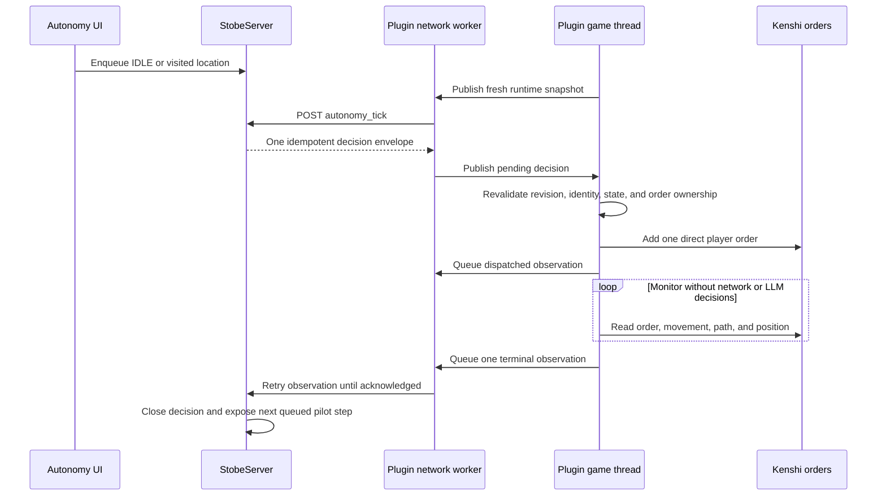

# Stobe Autonomy Phase 2 Plan

Status: Complete by operator acceptance
Last updated: 2026-07-14

## Goal

Build a deterministic closed loop for one selected player-faction NPC using
only `IDLE` and `TRAVEL_LOCATION`. Phase 2 proves decision correlation,
single-action execution, completion monitoring, interruption handling, and
auditability without calling an LLM.

Phase 2 is an internal technical pilot. It does not yet decide what the NPC
wants. Phase 3 will replace the deterministic pilot input with the supervised
LLM planner while retaining the same decision contract, executor, monitor, and
safety gates.

## Completion Record

Phase 2 was accepted on 2026-07-14 after implementation, automated validation,
production deployment, and a live Kenshi run.

Verified in the final live run:

- Save loading completed with the post-load Stobe hook and Direct Control
  reacquisition both remaining stable.
- One `IDLE` step received one decision ID, dispatched once, and completed with
  `idle_stable`.
- A visited-location travel step received one decision ID and dispatched once.
  A target already inside the eight-unit arrival radius completed by distance;
  a second run visibly moved Doran from a distant start.
- The distant run terminated after 16.9 active seconds with the bounded
  `owned_order_missing` failure instead of looping or issuing a second action.
- Game pause time did not advance the action timer.
- Normal stop returned the session to `DISABLED`; closing Kenshi produced a
  clean exit with no crash dump.

Portable C++ tests cover arrival, path failure, no progress, timeout, manual
interruption, stale identity and revision handling, and envelope validation.
Server tests cover idempotency, decision transitions, pilot validation,
playthrough lifecycle behavior, and report acknowledgement.

The operator accepted Phase 2 without repeating manual-order interruption,
active-action save/load invalidation, emergency cancellation, and network-loss
recovery in the final live session. Keep those scenarios as required regression
checks before a Phase 3 build is promoted beyond internal testing.

## Critical Design Decisions

### Use an explicit deterministic pilot queue

The server will not invent destinations or repeatedly issue idle commands. The
Autonomy UI will let the operator enqueue an `IDLE` step or a
`TRAVEL_LOCATION` step targeting an exact row from `location_zones`. The server
will issue queued steps one at a time through the normal autonomy tick loop.

This provides repeatable tests without an LLM and prevents the pilot from
moving a character somewhere the operator did not select. Phase 3 adds a new
producer of validated decisions; it does not replace the queue-to-executor
contract.

### Do not use the current fire-and-forget travel loop

The interactive `TRAVEL_LOCATION` implementation currently clears AI goals,
clears jobs repeatedly, disables jobs, and refreshes the destination every 250
milliseconds. `QueuedAction` also has no decision ID, control revision,
deadline, ownership marker, or result callback.

The autonomy path must not call that implementation or add entries to
`g_travelTargets`. Phase 2 will use the direct order path validated in Phase 0:

```cpp
orders->addOrder(task, subject, location, false, false);
```

The only allowed task mappings are:

| Command | Kenshi task |
| --- | --- |
| `IDLE` | `IDLE` |
| `TRAVEL_LOCATION` | `MOVE_CUS_ORDERED` |

No raw task number is accepted from the server or UI.

### The plugin owns runtime truth

StobeServer owns durable intent and audit history. The plugin owns identity
validation, dispatch, active order ownership, completion predicates, and
immediate safety pauses because only the main game thread can inspect current
Kenshi state safely.

### A terminal observation must not be lossy

Phase 1 uses a single pending report slot and removes a report before checking
the HTTP result. Phase 2 must replace that with a bounded outbound queue.
State heartbeats may be coalesced, but dispatch and terminal observations stay
queued until the server acknowledges their idempotency key.

## Closed-Loop Flow



## Server Data Model

Add the schema to `data/schema.sql`, the migration registry, playthrough clone
coverage, and runtime schema guards.

### `autonomy_decision`

Use a durable row as the source of truth for each issued decision:

- `decision_id TEXT PRIMARY KEY`, generated as a PHP UUID v4 without requiring
  a PostgreSQL extension.
- `session_id SMALLINT NOT NULL DEFAULT 1`.
- `control_revision BIGINT NOT NULL`.
- `npc_id`, `npc_storage_id`, and `runtime_serial` identity fields.
- `command TEXT NOT NULL`, limited in Phase 2 to `IDLE` or
  `TRAVEL_LOCATION`.
- `arguments JSONB NOT NULL` containing the validated immutable argument
  snapshot.
- `context_hash TEXT NOT NULL` and `context_game_ts BIGINT NOT NULL`.
- `status TEXT NOT NULL`: `ISSUED`, `DISPATCHED`, `COMPLETED`, `FAILED`,
  `INTERRUPTED`, `TIMED_OUT`, or `CANCELLED`.
- `issued_at`, `dispatch_deadline_at`, `action_deadline_at`, `terminal_at`, and
  `updated_at`.
- `outcome_reason TEXT NOT NULL DEFAULT ''`.

Add a partial unique index allowing at most one non-terminal decision for the
singleton session. Do not rely only on `autonomy_session.current_action` to
enforce the one-action invariant.

### `autonomy_pilot_step`

Store deterministic operator-supplied steps:

- Monotonic `id BIGSERIAL PRIMARY KEY`.
- Session and control revision.
- Canonical command and validated arguments.
- `location_zone_id` for travel steps.
- `PENDING`, `CLAIMED`, `COMPLETED`, or `CANCELLED` status.
- Link to the resulting `decision_id`.
- Created and updated timestamps.

Control revision changes cancel unclaimed steps from the old revision.

### `autonomy_session`

Add explicit cadence and display fields instead of hiding all state in JSON:

- `last_decision_local_ts`.
- `next_decision_local_ts`.
- `active_decision_id`.
- `active_elapsed_ms`.

Continue mirroring the active goal/action into `current_goal` and
`current_action` for the UI, but treat `autonomy_decision` as authoritative.

## Server API Contracts

### `POST /autonomy_pilot.php`

Actions:

- `enqueue_idle`.
- `enqueue_travel` with a numeric `location_zone_id`.
- `cancel_pending`.

Requirements:

- Match the current control revision.
- Require an enabled, online session with a selected NPC.
- Query `location_zones` by primary key, not by fuzzy name.
- Require finite non-null `x`, `y`, and `z` values.
- Snapshot the location ID, zone name, city name, and coordinates into the
  queued step.
- Never accept raw travel coordinates from the browser.

### `POST /autonomy_tick.php`

The request contains:

- Control revision and selected NPC identity.
- Runtime serial.
- Snapshot sequence, game timestamp, and bounded context hash.
- Position, order fingerprint, movement, path, and safety facts.
- Current plugin state and active decision ID, if any.

Inside one database transaction with the session row locked, the endpoint:

1. Rejects stale control revisions and identity mismatches.
2. Rejects stale or malformed runtime snapshots.
3. Returns the same open decision when one already exists.
4. Otherwise claims the next valid pilot step and creates one decision.
5. Returns `decision: null` when no step is ready.

The response decision envelope contains:

- Decision ID and control revision.
- Exact selected NPC identity.
- Canonical command.
- Typed arguments.
- Context hash expected by the server.
- Dispatch and action deadlines.

Duplicate ticks must return the same decision ID and must never create a
second open decision.

### `POST /autonomy_observation.php`

Support typed state and action observations. An action observation includes:

- Decision ID and control revision.
- Event key.
- `DISPATCHED` or one terminal outcome.
- Runtime serial and bounded runtime snapshot.
- Machine-readable reason.
- Active elapsed time.

Validate legal status transitions with a compare-and-update query. Duplicate
event keys return success without applying the transition twice. A terminal
observation closes the decision, updates the pilot step, clears the session's
active action, and enters `COOLDOWN` or a paused state.

### Control changes

`pause`, `resume`, `stop`, `emergency_stop`, and NPC selection already advance
the control revision. In the same control transaction, mark any old open
decision and pending pilot steps `CANCELLED`. A response from an older revision
can then be logged and rejected without becoming executable.

## Plugin Architecture

### Protocol types

Extend `AutonomyProtocol` with portable structs and parsers for:

- `RuntimeSnapshot`.
- `DecisionEnvelope`.
- `ActionObservation`.
- Strict typed `IDLE` and `TRAVEL_LOCATION` arguments.

Parsing must reject unknown commands, missing IDs, invalid revisions, expired
deadlines, non-finite coordinates, and identity mismatches.

### Thread ownership

The game thread is the only thread allowed to read or mutate Kenshi objects.
It publishes plain-data snapshots to the network worker. The worker performs
HTTP calls and publishes parsed decisions back through a mutex-protected
mailbox.

Use these queues:

- One coalesced latest runtime snapshot for tick requests.
- At most one in-flight tick request.
- One pending decision mailbox.
- A bounded reliable observation deque with retry and backoff.

No HTTP callback may dispatch a Kenshi action.

### New runtime components

Add focused files rather than growing `AutonomyController.cpp` into the action
executor:

- `AutonomyExecutor.h/.cpp`: exact main-thread dispatch and safe cancellation.
- `AutonomyMonitor.h/.cpp`: pure outcome predicates and active action state.
- `AutonomyProtocol.h/.cpp`: wire contracts and stale-response validation.
- `KenshiAiCompat.h/.cpp`: bounded runtime snapshots and order fingerprints.

Keep policy and completion logic portable so it can be tested without Kenshi.

## Order Ownership

Phase 1 treats every player order as manual. That is no longer sufficient once
autonomy creates a player order.

Before dispatch:

- Require no existing player order.
- Snapshot jobs enabled, permanent jobs, other player-character orders, and
  selected NPC identity.

After `addOrder`, capture an `OwnedOrderFingerprint`:

- Decision ID.
- Expected task type.
- Expected subject serial.
- Expected location with tolerance.
- First-order pointer value for the current runtime only.
- Order deque size.
- Dispatch snapshot sequence and timestamp.

During monitoring, the expected single matching order is autonomy-owned. A
different first order, an added order, or a mismatched location is manual
intervention. On intervention:

- Do not clear any order.
- Mark the decision `INTERRUPTED` with
  `manual_player_order_detected`.
- Enter latched `PAUSED_USER` until an explicit resume revision arrives.

Cancellation may call `OrdersReceiver::clearOrders()` only when the order deque
contains exactly one order and its task, subject, location, and runtime pointer
match the owned fingerprint. If ownership is uncertain, leave the orders
untouched and report `owned_order_not_safe_to_cancel`.

Never call `clearJobs`, `clearPermajobs`, `clearAllAIGoals`,
`setJobsEnabled`, or the current persistent travel-target loop from the
autonomy executor.

## Action Predicates

### `IDLE`

Dispatch:

- Use the selected NPC's current position.
- Add one `IDLE` order with `clearOld=false` and `shift=false`.
- Revalidate that jobs and other NPC orders did not change.

Success:

- The expected order was accepted.
- The NPC is not moving for consecutive monitor samples.
- The NPC remains conscious, alive, loaded, and player-faction.

Failure:

- Order rejection, unsafe character state, or dispatch deadline exceeded.

Completion should be short and deterministic. After success, safely remove the
owned idle order only if its fingerprint still matches.

### `TRAVEL_LOCATION`

Dispatch:

- Use coordinates snapshotted from an exact visited `location_zones` row.
- Add one `MOVE_CUS_ORDERED` order with `clearOld=false` and `shift=false`.
- Request `RUN` speed without changing jobs, goals, passive, or hold settings.

Success:

- Distance to the destination is at most 8 world units.
- The NPC is stopped or the expected movement order has completed for
  consecutive monitor samples.

Do not depend on `hasDestinationBeenReached()` alone; Phase 0 proved it can
remain false after arrival.

Failure:

- Dispatch rejection.
- Repeated `pathFailed()` samples.
- No meaningful distance progress during the configured watchdog window.
- Action deadline exceeded, excluding time while the game is paused.
- Character death, unconsciousness, unload, or loss of player-faction status.

Manual order replacement is an interruption, not a travel failure.

## State Transitions

The Phase 2 happy path is:

```text
OBSERVING -> DECIDING -> ACTION_QUEUED -> EXECUTING
EXECUTING -> COOLDOWN -> OBSERVING
```

Rules:

- `DECIDING` means exactly one tick request is in flight.
- `ACTION_QUEUED` means a validated decision is waiting for main-thread
  dispatch.
- `EXECUTING` means one owned order is being monitored.
- `COOLDOWN` begins only after the terminal observation is queued durably.
- Server loss while executing does not erase the local monitor. Finish or
  interrupt the owned action, retain the terminal observation, and stop asking
  for new decisions.
- Save/load invalidates pointers and active decisions, queues or records an
  interruption where possible, and enters `PAUSED_UNSAFE`. It never resumes an
  old order automatically.

## Control Semantics

- Pause: cancel the owned order only when its fingerprint is exact, report an
  interruption, and latch `PAUSED_USER`.
- Resume: advance the revision, revalidate identity and an empty player-order
  slot, then return to `OBSERVING`.
- Normal stop: cancel safely, close old work, and disable future decisions.
- Emergency stop: immediately invalidate pending decisions and attempt the
  same ownership-safe cancellation. It must not clear unrelated player orders
  or jobs.
- Manual intervention: preserve the player's replacement order and pause.

## UI Changes

Update `ui/autonomy.php` for the technical pilot:

- Change the phase label to `Phase 2 Deterministic Pilot`.
- Add an `IDLE` queue button.
- Add a visited-location selector populated by exact `location_zones` IDs.
- Add a `Queue Travel` button.
- Show pending pilot steps.
- Show decision ID, command, destination, deadline, elapsed time, and outcome.
- Distinguish control state from active action state.
- Disable queue controls unless the plugin is online, enabled, and at the
  current revision.

The UI must use asynchronous updates and must not reload the page.

## Implementation Order

### 2.1 Server decision ledger

- Add schema, migration, playthrough lifecycle handling, and helper methods.
- Add exact visited-location listing and pilot queue endpoint.
- Implement transactional idempotent tick issuance.
- Implement typed observation state transitions.
- Extend PHP regression tests before enabling any plugin dispatch.

### 2.2 Portable protocol and policy

- Add strict decision parsing and typed arguments.
- Add stale revision, deadline, identity, and duplicate decision guards.
- Add pure order-fingerprint and completion predicate tests.

### 2.3 Reliable network bridge

- Add snapshot and decision mailboxes.
- Replace the lossy report slot with acknowledged retry queues.
- Add bounded backoff and queue diagnostics.
- Keep all Kenshi access on the main thread.

### 2.4 Deterministic executor

- Implement direct `IDLE` dispatch.
- Implement direct `TRAVEL_LOCATION` dispatch.
- Capture and verify order ownership and cross-character invariants.
- Implement ownership-safe cancellation.

### 2.5 Runtime monitor

- Implement success, failure, interruption, timeout, and save/load outcomes.
- Add active-time accounting that excludes game pause time.
- Feed terminal observations into the reliable queue.

### 2.6 UI and audit timeline

- Add pilot controls and exact location selection.
- Render active decision and queued steps.
- Render machine-readable terminal reasons in the event timeline.

### 2.7 Build, deployment, and live gate

- Run portable C++ tests and the v100 DLL build.
- Run autonomy PHP tests and playthrough schema tests.
- Deploy StobeServer and Stobe.dll.
- Complete the live acceptance sequence below before marking Phase 2 complete.

## Automated Test Matrix

### PHP

- Exact location ID validation and rejection of raw coordinates.
- One open decision under concurrent or duplicate ticks.
- Duplicate tick returns the same decision ID.
- Duplicate observation is idempotent.
- Illegal decision status transitions are rejected.
- Old revisions and wrong NPC identities are rejected.
- Pause, stop, selection, and resume cancel old queued work.
- Playthrough creation, clone, rollback, and deletion include new tables.

### Portable C++

- Strict decision envelope parsing.
- Unknown command and non-finite coordinate rejection.
- Stale revision, identity, context, and deadline rejection.
- One in-flight tick and one active action invariants.
- Owned-order fingerprint match and mismatch cases.
- `IDLE` completion after consecutive stationary samples.
- Travel arrival, path failure, no-progress, timeout, and manual-interruption
  predicates.
- Save/load and server-loss transitions.
- Reliable observation retry and acknowledgement behavior.

## Live Acceptance Gate

Phase 2 is complete only when one live run proves all of the following:

1. Queue one `IDLE` and one visited-location travel step.
2. Each step receives one decision ID and dispatches exactly once.
3. The UI and database show `DISPATCHED` and the correct terminal outcome.
4. Duplicate ticks and observations do not repeat an action or event.
5. Travel succeeds by distance and stable movement state.
6. An unreachable or deliberately expired travel reports a bounded failure.
7. A manual move order interrupts autonomy within one plugin update, preserves
   the player's order, and latches `PAUSED_USER`.
8. Pause, normal stop, and emergency stop cancel only an exact owned order.
9. Save/load invalidates the active decision and leaves autonomy paused.
10. Selected NPC jobs, permanent jobs, and standing orders remain unchanged.
11. Other player characters' orders remain unchanged.
12. Network interruption cannot lose a terminal observation or allow a second
    action.

Exit criterion: repeated deterministic `IDLE` and `TRAVEL_LOCATION` decisions
execute one at a time, produce accurate durable outcomes, and stop safely on
manual intervention, control changes, save/load, and server loss.
