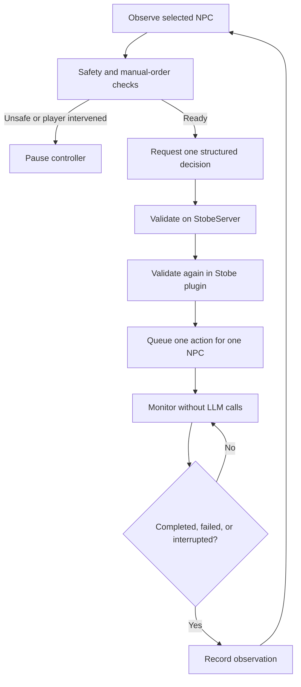

# Stobe Single-NPC Autonomy Plan

Status: Active implementation; Phase 0 validated  
Last updated: 2026-07-14

## Objective

Allow the player to select one player-faction NPC and let that NPC make supervised decisions and perform actions independently.

This is a broadly autonomous agent with access to every registered Stobe action. It still uses Stobe's validated command layer rather than arbitrary Kenshi memory or internal AI calls. The controller will:

1. Observe the selected NPC and nearby world state.
2. Ask the configured LLM for one structured decision.
3. Validate that decision on both the server and plugin.
4. Execute one permitted action directly on that NPC.
5. Monitor the action without further LLM calls.
6. Report completion, failure, or interruption before requesting another decision.

The initial goal is an observable closed loop that can use combat, economy, looting, relationship, squad, and work actions whenever their runtime preconditions are satisfied. New actions still need explicit adapters and completion predicates before they can be registered.

## Scope

### In Scope

- One autonomous NPC per playthrough.
- Player-faction NPCs only.
- Server UI for selecting and controlling the autonomous NPC.
- Persistent goals and an auditable decision/action history.
- A live action allowlist computed from the current context and policy.
- Deterministic action completion and failure detection in the plugin.
- Immediate pause on manual player intervention or unsafe state changes.
- All registered actions enabled by default, with per-action user overrides.
- Additional survival and world-interaction actions where the current action catalog has gaps.

### Out of Scope for the First Release

- Multiple autonomous NPCs or squad-level planning.
- Arbitrary raw Kenshi AI task creation that bypasses Stobe's command validation and action executor.
- Full economic simulation or automated trading.
- Server-side action execution without an active plugin request.
- Automatic resume after loading a save.

## Feasibility and Dependency Baseline

Stobe now targets the KenshiLib revision used by RE_Kenshi:

`18f75fecb93cfead6029efe0d5fe199d6618bcc9`

The revision exposes the AI and order APIs required for a supervised controller:

- `Character::getOrdersReciever()` in `third_party/kenshi/KenshiLib Source/Include/kenshi/Character.h`.
- `OrdersReceiver::addOrder()` and `OrdersReceiver::addJob()` in `third_party/kenshi/KenshiLib Source/Include/kenshi/AITaskSystem.h`.
- `OrdersReceiver::hasPlayerOrders()` and `OrdersReceiver::isJobsEnabled()` in `AITaskSystem.h`.
- `AITaskSytem::getCurrentGoalString()` in `AITaskSystem.h`.
- `AI::getTaskSystem()` in `third_party/kenshi/KenshiLib Source/Include/kenshi/AI.h`.
- `Character::canTakePlayerOrdersAtThisTime()` in `Character.h`.

The implementation must directly address the selected NPC. It must not use `PlayerInterface::addOrderSelectedCharacters()`, because that can apply an action to every selected character.

Protected, private, or internal methods such as `_clearGoals`, `clearAllTasks`, and `_forcedSetCurrentAction` are not approved integration points. The LLM must never emit raw `TaskType` values.

## Existing Integration Points

The implementation should build on the current Stobe request and action pipelines instead of creating a second executor.

### Stobe Plugin

- Action definitions: `Stobe/src/Globals.h`.
- Action dispatch and execution: `Stobe/src/Functions.cpp`.
- Existing travel action: `Stobe/src/Functions.cpp`.
- Stable main update loop and bored trigger: `Stobe/src/main.cpp`.
- Character activity and world context: `Stobe/src/Context.cpp`.
- Player squad synchronization: `Stobe/src/main.cpp`.
- Server request resolution: `Stobe/src/Comm.cpp`.

### StobeServer

- Action catalog schema: `StobeServer/data/schema.sql`.
- Known location storage: `StobeServer/data/schema.sql`.
- Action seed data: `StobeServer/data/schema.sql`.
- Action configuration and per-NPC filtering: `StobeServer/lib/chat_helper_functions.php`.
- Action response parsing: `StobeServer/lib/chat_helper_functions.php`.

The plugin must initiate every autonomy request. StobeServer cannot asynchronously push a command into Kenshi when there is no active plugin request.

## Architecture

The system has four responsibilities:

1. **Control plane:** Select, start, pause, resume, and stop the autonomous NPC.
2. **Planner:** Produce one structured goal/action decision from current context.
3. **Executor:** Validate and queue a permitted command for the selected NPC.
4. **Monitor:** Determine whether the command completed, failed, timed out, or was interrupted.



### Command Routing

Autonomy decisions should use the same command normalization and execution path as existing Stobe actions. Refactor the current response parser into a shared helper if necessary so autonomous and interactive commands cannot diverge.

Every command must carry:

- `session_id`
- `decision_id`
- `control_revision`
- selected NPC identity
- expected completion metadata
- deadline

The server validates policy and shape. The plugin revalidates policy, identity, faction, context freshness, and action preconditions immediately before execution.

## Controller State Machine

The plugin owns the authoritative runtime state machine.

| State | Meaning |
| --- | --- |
| `DISABLED` | No autonomous NPC is configured. |
| `ARMING` | Resolving and validating the selected NPC. |
| `OBSERVING` | Building a current world and character snapshot. |
| `DECIDING` | One server decision request is in flight. |
| `ACTION_QUEUED` | A validated action is waiting for dispatch. |
| `EXECUTING` | The action is active and monitored locally. |
| `COOLDOWN` | Waiting for the next permitted decision time. |
| `PAUSED_USER` | Paused because the player intervened or requested a pause. |
| `PAUSED_UNSAFE` | Paused because game state is unsafe or ambiguous. |
| `ERROR` | Repeated or unrecoverable controller failure. |

### Invariants

- At most one decision request is in flight.
- At most one autonomy-issued action is active.
- Only the selected player-faction NPC can receive that action.
- A stale decision can never execute after a control revision changes.
- Completion monitoring does not call the LLM.
- A failed action cannot retry indefinitely.

### Automatic Pause Conditions

Pause autonomy when:

- The player issues a manual order to the controlled NPC.
- The NPC leaves the player faction.
- The NPC is dead, unconscious, imprisoned, invalid, or unloaded.
- A save is loaded or game time moves backward.
- The runtime character handle no longer matches the stored identity.
- StobeServer is unavailable or returns malformed data.
- The selected action becomes invalid before dispatch.
- Context is stale.
- The controller enters a state that cannot be resolved safely.

Combat is not itself a pause condition. The controller may select registered combat actions, while Kenshi's native combat AI continues to handle moment-to-moment behavior between decisions. Planning pauses only when the NPC cannot accept orders or the runtime state is otherwise unsafe or ambiguous.

### Stop Behavior

Normal stop disables future planning after the current state is safely resolved. Emergency stop removes only the controller-issued action where technically possible. It must not erase unrelated player jobs, clear the entire Kenshi AI task stack, or alter jobs settings globally.

## NPC Identity and Selection

Selection occurs in StobeServer and is limited to recently observed player-faction NPCs.

Identity should include:

- Stable Stobe `storage_id` or reference ID.
- Stobe NPC database ID.
- NPC name as a fallback diagnostic field, not the primary key.
- Runtime character handle serial tracked only for the current game session.

Before every action, the plugin must resolve the current character handle and confirm that the NPC still belongs to the player faction.

Only one active autonomy session is permitted per playthrough. Loading a save invalidates the current runtime handle and action. The controller returns in a paused state and must resolve the NPC again before the user resumes it.

## Persistence

### `autonomy_session`

Store one active controller record per playthrough.

Suggested columns:

- `id`
- `npc_id`
- `npc_storage_id`
- `npc_name`
- `state`
- `enabled`
- `control_revision`
- `policy` as JSON
- `current_goal` as JSON
- `current_action` as JSON
- `last_decision_local_ts`
- `last_decision_game_ts`
- `next_decision_local_ts`
- `next_decision_game_ts`
- `last_observation`
- `last_error`
- `created_at`
- `updated_at`

### `autonomy_event`

Store an append-only audit trail.

Suggested columns:

- `id`
- `session_id`
- `decision_id`
- `local_ts`
- `game_ts`
- `event_type`
- `goal`
- `command`
- `arguments` as JSON
- `outcome`
- `reason`
- bounded context snapshot or snapshot hash
- prompt hash
- response hash
- request latency

Schema creation, playthrough cloning, import/export, rollback, and database update scripts must all understand these tables.

## Server API

### `GET /autonomy_state.php`

Returns lightweight control state for plugin polling:

- enabled/paused state
- selected NPC identity
- `control_revision`
- current policy
- whether a new observation or decision is requested

### `POST /autonomy_tick.php`

Accepts the current context and previous observation. Returns zero or one idempotent decision.

Example response:

```json
{
  "decision_id": "uuid",
  "control_revision": 12,
  "goal": {
    "summary": "Find somewhere safe to rest",
    "expires_after_game_seconds": 3600
  },
  "action": {
    "command": "TRAVEL_LOCATION",
    "target": "Squin",
    "item": "",
    "amount": 0
  },
  "reconsider_after_seconds": 30
}
```

### `POST /autonomy_observation.php`

Records action success, failure, timeout, or interruption. Duplicate observations for the same decision must be idempotent.

### `POST /autonomy_control.php`

Used by the UI to select an NPC and start, pause, resume, stop, or emergency-stop the controller. Every state-changing request increments `control_revision`.

### API Safety

Reject requests with:

- stale `control_revision`
- unknown session or decision IDs
- mismatched NPC identity
- an expired context timestamp
- an action outside the live allowlist
- an action that does not match the current policy
- duplicate execution attempts

## Planning Context

Each decision request should contain only the information needed for the next decision:

- NPC identity, profile, personality, and long-term directive.
- Current persistent goal.
- Location, time, weather, and relevant world state.
- Health, hunger, limbs, consciousness, combat, and carrying state.
- Inventory, equipment, and available money.
- Current Kenshi goal, order, task, path, and jobs state.
- Nearby NPCs, items, objects, and points of interest.
- Locations already visited by the player faction.
- Recent autonomy observations and failures.
- Live computed action allowlist with required arguments.

The model output must conform to a strict structured schema. It may return no action and wait. It cannot emit arbitrary code, raw AI tasks, or a command absent from the supplied allowlist.

## Decision Cadence

The controller must not query the LLM every frame.

Request a decision only when:

- Autonomy starts or resumes.
- The previous action completes, fails, or is interrupted.
- An important state change invalidates the current goal.
- The NPC is idle and the next decision time has arrived.

Recommended defaults:

- Minimum 30 real seconds between idle decisions.
- Optional game-time floor of 10 to 15 in-game minutes.
- Monitor active actions locally approximately once per second.
- Apply exponential real-time backoff after server or LLM failures.
- Do not advance the next decision timer while the game is paused.

## Action Policy

### Default Allowlist

Every registered Stobe action is enabled for autonomy by default. The live allowlist removes an action only when its runtime preconditions are not satisfied or the user has explicitly disabled it for autonomy.

This explicitly includes:

- `ATTACK`
- `KILL`
- `KNOCKOUT`
- `REMOVE_LIMB`
- `CUT_HORNS`
- `TAKE_ITEM`
- Cats transfer actions
- drugs and alcohol actions
- faction relation changes
- joining or leaving squads
- travel, object use, carrying, dialogue, roleplay, stance, inventory, equipment, economy, and other registered actions

Potentially destructive actions still require a valid target, valid arguments, current context, and a deterministic dispatch result. These checks prevent malformed or stale commands; they do not disable the behavior by default.

### Raw Kenshi Tasks

Raw `TaskType` values are not model-facing commands because they bypass Stobe's validation and make completion difficult to observe safely. "Any task" means every action registered through Stobe's command layer. If an underlying Kenshi task is not represented yet, add a named Stobe action adapter with argument validation, direct NPC targeting, and a completion predicate rather than exposing arbitrary task IDs.

Following another NPC must be supported through a dedicated, directly addressed action. The existing player-faction restriction should be removed or replaced for the autonomy path once that adapter has been validated to affect only the controlled NPC.

### New Actions, in Priority Order

1. `FIRST_AID`: Treat self or an eligible nearby ally.
2. `REST`: Select and use a valid bed or sleeping object.
3. `FLEE`: Move away from immediate hostiles to a validated safe destination.
4. `MOVE_NEARBY`: Move to a local coordinate or nearby point of interest.
5. `EQUIP_ITEM` or `EQUIP_BEST`: Prefer deterministic equipment rules over open-ended model selection.
6. `LOOT_TARGET`: Loot an explicit valid target under policy restrictions.
7. `BUY_ITEM`: Perform a real trader transaction.
8. `SELL_ITEM`: Perform a real trader transaction.
9. `WORK_RESOURCE`: Use an eligible resource or production object.
10. `PROSPECT`: Inspect local resources and report the result.

The first useful autonomy release should prioritize `FIRST_AID`, `REST`, and `FLEE`. Existing give/take commands are not substitutes for real trading.

## Completion Predicates

Each action requires a deterministic completion predicate, deadline, and failure reason.

| Action | Success | Failure or interruption |
| --- | --- | --- |
| Travel | NPC reaches the destination radius and stops. | Path impossible, timeout, invalid destination, manual order. |
| Use object | Expected object task becomes active and completes or exits normally. | Object unavailable, task rejected, timeout. |
| First aid | Target is stabilized or the medical task completes. | No supplies, invalid target, task rejected, timeout. |
| Rest | NPC enters the selected bed or sleeping object. | Bed unavailable, path failure, task rejected. |
| Flee | Immediate hostiles are beyond the safety threshold with no active pursuit. | Trapped, path failure, timeout. |
| Pick up | NPC is carrying the requested target. | Invalid target, cannot carry, timeout. |
| Stop carrying | NPC is no longer carrying anything. | Action rejected or timeout. |
| Item transfer | Expected inventory delta is observed. | Missing item, capacity failure, invalid recipient. |
| Toggle | Observed state equals the requested state. | State cannot change or context becomes invalid. |
| Attack, later | Target is dead, unconscious, escaped, or invalid according to policy. | Player interruption, controller safety stop, timeout. |
| Talk | Delivery acknowledgement is received. | Target unavailable or delivery fails. |

Do not blindly retry. The default retry limit should be zero, with at most one retry for explicitly classified transient failures.

## User Interface

Create `StobeServer/ui/autonomy.php` as the primary control surface.

### Required Controls

- NPC selector filtered to recently seen player-faction NPCs.
- Start.
- Pause.
- Resume.
- Stop.
- Emergency stop.

### Required Status

- Controller state badge.
- Selected NPC identity.
- Current goal.
- Current action and elapsed time.
- Last observation.
- Last error.
- Next permitted decision time.
- Recent autonomy event timeline.

### Configuration

- LLM connector selection.
- Decision cadence.
- Policy preset: `Full Autonomy` by default, with an optional custom profile.
- Per-action permissions, all enabled by default.
- Optional long-term directive for the selected NPC.

Add an `Autonomy` button to eligible player-faction cards in `StobeServer/ui/stobenpcs.php`. A compact homepage status card can be considered after the main control page is stable; it is not required for the MVP.

In-game hotkeys or settings are a later enhancement, not an MVP dependency.

## Plugin Implementation

### New Files

- `Stobe/src/AutonomyController.h`
- `Stobe/src/AutonomyController.cpp`
- `Stobe/src/KenshiAiCompat.h`
- `Stobe/src/KenshiAiCompat.cpp`

`AutonomyController` owns the state machine, request cadence, identity checks, action correlation, and observations. `KenshiAiCompat` contains the narrow tested wrapper around KenshiLib AI/order APIs so revision-specific behavior is isolated.

### Modified Files

- `Stobe/src/main.cpp`: Run autonomy after stable world and character checks.
- `Stobe/src/Context.cpp`: Build the autonomy snapshot and expose current AI goal, order, path, and player-order state.
- `Stobe/src/Comm.cpp`: Add control, tick, and observation requests.
- `Stobe/src/Globals.h`: Add queue source, session/decision IDs, control revision, deadline, and completion metadata.
- `Stobe/src/Functions.cpp`: Dispatch through the shared executor and report action outcomes.
- `Stobe/CMakeLists.txt`: Include new source files.
- `Stobe/Stobe.vcxproj`: Include new source files for Visual Studio builds.

## Server Implementation

### New Files

- `StobeServer/lib/autonomy_helper_functions.php`
- `StobeServer/autonomy_state.php`
- `StobeServer/autonomy_tick.php`
- `StobeServer/autonomy_observation.php`
- `StobeServer/autonomy_control.php`
- `StobeServer/ui/autonomy.php`
- autonomy unit and endpoint tests

### Modified Areas

- `StobeServer/data/schema.sql`
- `StobeServer/debug/db_updates.php`
- navbar configuration
- playthrough schema creation and cloning
- rollback and import/export handling
- action filtering and prompt construction
- connector and default settings

## Delivery Phases

### Phase 0: Kenshi AI Safety Spike

Implementation status (2026-07-14): complete for the Phase 1 gate. The
disabled-by-default local safety harness, portable policy tests, v100 build,
local deployment, and target-build validation are complete. The live run proved
single-target telemetry, IDLE and travel dispatch, existing-order rejection,
job preservation, other-character order preservation, and save/load nonce
safety. Destructive dead/unconscious transitions remain a pre-release in-game
regression; their mutation guards are covered by portable policy tests. See
`docs/AUTONOMY_PHASE0_TESTING.md`.

- Log the current goal, order, jobs state, player-order state, and path state for one player NPC.
- Verify behavior across save/load, knockout, death, squad changes, and unload/reload.
- Issue deterministic direct `IDLE` and travel commands without an LLM.
- Prove that commands affect only the target NPC.

Exit criterion: direct control and cancellation behavior are understood and do not corrupt unrelated jobs or orders.

Result: met on 2026-07-14. The probe was disabled after validation.

Implementation note: Kenshi cleared the validated travel order after reaching
the requested coordinates, but `CharMovement::hasDestinationBeenReached()`
remained false in the sampled telemetry. Phase 1 completion logic must combine
distance to the requested target with order and path state rather than relying
on that flag alone.

### Phase 1: Control Plane

- Add schema and database migrations.
- Add control/state endpoints.
- Add the autonomy UI and NPC selector.
- Implement plugin polling, identity resolution, and state transitions.
- Add pause, resume, stop, and emergency stop.

Exit criterion: the UI can safely select one player-faction NPC and the plugin reflects control changes without executing autonomous actions.

### Phase 2: Deterministic Closed-Loop Pilot

- Support `IDLE` and `TRAVEL_LOCATION` only.
- Add action correlation, deadlines, completion predicates, and observations.
- Add idempotency and stale revision rejection.
- Detect manual orders and save/load invalidation.

Exit criterion: repeated deterministic decisions execute one at a time, report accurate outcomes, and stop safely on intervention.

### Phase 3: Supervised LLM Planner

- Add strict structured decision output.
- Add persistent goals and recent event context.
- Enable every registered Stobe action by default.
- Compute the live action allowlist from runtime preconditions and explicit user overrides.
- Add event-driven cadence and cost controls.
- Add malformed response and connector failure handling.

Exit criterion: the model can choose any registered action whose current preconditions pass, but cannot bypass the validated executor or execute stale commands.

### Phase 4: Survival Autonomy

- Implement `FIRST_AID`.
- Implement `REST`.
- Implement `FLEE`.
- Implement `MOVE_NEARBY`.
- Add survival-oriented goal and completion tests.

Exit criterion: the NPC can handle common non-combat survival needs without continuous player direction.

### Phase 5: Expanded Equipment, Loot, and Combat Support

- Add deterministic equipment behavior.
- Add constrained looting.
- Complete deterministic outcome monitoring for all combat actions.
- Verify controlled combat actions coexist with Kenshi's native combat behavior.

Exit criterion: every irreversible or hostile action has validated arguments, deterministic cancellation, and observable outcome handling while remaining enabled by default.

### Phase 6: Economy and Work

- Add real trader interactions.
- Add buying and selling policy limits.
- Add resource work and prospecting.
- Integrate town economy awareness when inventory and price observations are reliable.

Exit criterion: economic actions reflect actual inventory and money changes rather than simulated transfers.

## Testing Strategy

### Portable C++ Tests

- State-machine transitions.
- Stale control revision handling.
- One-request and one-action invariants.
- Deadline and retry behavior.
- Manual intervention transitions.
- Save/load invalidation.
- Completion predicate evaluation using mocked observations.

### PHP Tests

- Player-faction selection filtering.
- Action policy and live allowlist generation.
- Structured response validation.
- Duplicate tick and observation idempotency.
- Stale revision rejection.
- Endpoint authentication and validation.
- Playthrough schema creation and cloning.
- Safe handling of unavailable connectors and malformed model output.

### In-Game Smoke Tests

- Start, pause, resume, stop, and emergency stop.
- Multiple selected characters remain unaffected.
- Manual player order pauses autonomy within one plugin update.
- Save/load returns autonomy to paused and invalidates the old action.
- NPC death, knockout, imprisonment, unload, and faction change.
- Server timeout, missing LLM key, malformed JSON, and duplicate responses.
- Impossible travel path and action timeout.
- Game pause and speed changes.
- Native combat AI coexistence before, during, and after autonomy-issued combat actions.

## Logging and Diagnostics

Every decision should be traceable without storing unbounded prompts or world snapshots.

Log:

- session, decision, and revision identifiers
- state transition and reason
- selected NPC identity
- requested goal and action
- policy and allowlist result
- plugin validation result
- dispatch time and deadline
- completion, failure, interruption, or timeout reason
- server and LLM latency
- bounded snapshot, prompt, and response hashes

Sensitive connector credentials and full secret-bearing request headers must never be logged.

## Acceptance Criteria

- No more than one autonomous NPC is active per playthrough.
- The controlled NPC is revalidated as player-faction before every action.
- No more than one decision and one action are in flight.
- An autonomy command cannot fan out to other selected characters.
- A manual player order pauses autonomy within one plugin update.
- Loading a save invalidates stale actions and leaves autonomy paused.
- Path and task failures terminate with an observation instead of looping.
- Server or LLM timeout leaves the NPC under native Kenshi control.
- Every registered action is enabled by default unless the user explicitly disables it.
- Combat, theft, Cats transfers, consumables, relationship changes, squad changes, and body modification actions can all be selected when their runtime preconditions pass.
- Every decision and outcome appears in the audit timeline.
- Emergency stop does not erase unrelated jobs or orders.
- No action executes from stale context.
- The LLM cannot call a command absent from the live allowlist.

## Recommended Defaults

- Policy preset: `Full Autonomy`, with every registered action enabled.
- Save/load behavior: resume paused, never automatically.
- Combat behavior: allow autonomy to issue registered combat actions and let native Kenshi AI handle moment-to-moment execution.
- Decision cadence: event-driven with a 30-second real-time idle floor.
- Controller count: one NPC per playthrough.
- Retry behavior: no automatic retry unless the failure is explicitly transient.
- Long-term directive: optional and empty by default.

## Release Milestones

- Phase 2: internal technical pilot.
- Phase 3: first testable autonomy release.
- Phase 4: first release where the NPC can meaningfully play independently.
- Phases 5 and 6: expanded action depth after core execution and telemetry are proven.
